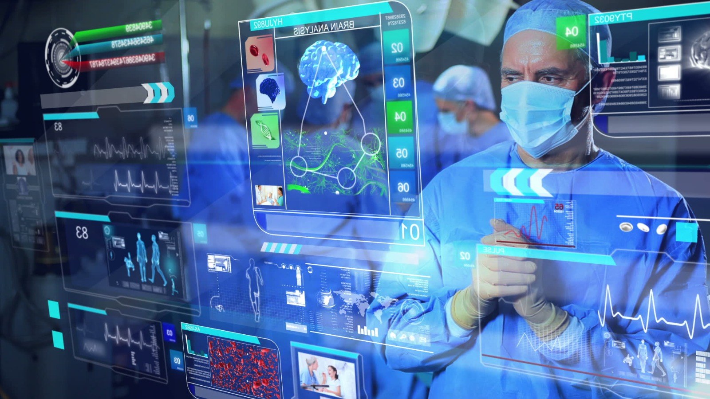
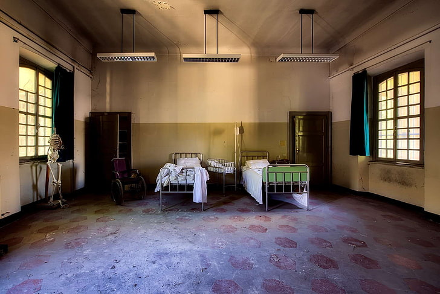
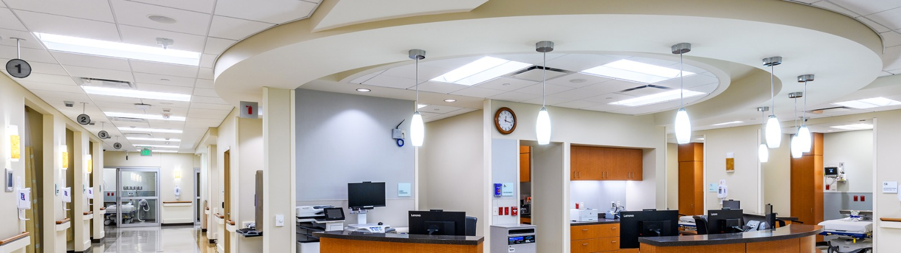

# Enhancing Investments in Health Information Technology

## Introduction
Health information technology (HIT) has become an essential part of the healthcare industry in recent years. Health information technology indicates the use of technology to manage and process healthcare information, including electronic health records of patients, medicine information, and health information exchange. The use of Health information technology has the potential to improve patient care, increase efficiency, and reduce healthcare and patient costs and paper works. However, investment in Health information technology has been limited, specifically in small and rural healthcare. This research paper aims to investigate the current state of investment in Health information technology and influence the Government to invest more in health information technology, particularly in small and rural healthcare.

## Technology in the healthcare system
 
Technology in Healthcare system 

Healthcare technology indicates any IT tools or applications designed to boost healthcare and administrative productivity, treatments, and quality of healthcare systems. The technology in the healthcare system is focused on decision-making and reveals the outputs from extensive data collection. The providers have gathered so much information that it would be impossible to analyze without technology like Artificial Intelligence. Artificial Intelligence helps the healthcare system generate complex data from traditional records, allowing providers to develop better healthcare conditions. Although advanced technology is still unpopular in so many healthcare systems in rural areas, they take care of the patients in the traditional way, which is difficult for physicians right now.

## History of Healthcare Technology
 
old healthcare system 

The roots of the health information management industry can be traced back to 1920 when healthcare professionals started using medical records to document and outcomes of patient medical care. In 1960 discussion began about how computers might enhance the practice of medicine and for the clinicians who decide to use computer technology. By the late 20th century, computers improved dramatically, and graphic user interfaces and networking technologies to connect computers were adopted widely for healthcare. Modern healthcare technology is commonly used in urban healthcare systems, especially in developed countries. Computer and electronic device plays a vital role in the operations of healthcare. From maintaining patient records to scheduling appointments, computers help hospital staff work more efficiently and effectively.

## Why Government should invest more in Healthcare Technology
 
The Government needs to be able to save the population against internal health outbreaks and pandemics. Unfortunately, spending on the healthcare system and technology compared to other areas like education, defense, business, and other development areas could be much higher for most countries. Government should recognize that healthcare and healthcare technology are crucial like the other investment area. More investment in healthcare facilitated the medical scientist to do better in the research fields and develop a new cure, a technology that is a milestone for the nation. As a developing country, the healthcare infrastructure should be modern and highly capable of patient care throughout the year, especially during the pandemic. For example, During the COVID-19 pandemic, modern healthcare did better than the small and rural healthcare systems worldwide. 
Furthermore, Healthcare technology can be anything from software to the internet, computers, and mobile applications that ease communication in taking care of patients. The main goals of Healthcare technology are to save patient information electronically and facilitate communication between healthcare and patients. The patients can make an appointment with a doctor by using a mobile phone, and availability of them to care for new patients. In Bangladesh, doctors still use pen and paper to write prescriptions, which slows down the whole healthcare system. On the other hand, healthcare technology helps healthcare workers work more efficiently and productively than in a traditional healthcare system.

## Benefits of Healthcare Technology
<iframe width="560" height="315" src="https://www.youtube.com/embed/SnodqxFgqnE" title="YouTube video player" frameborder="0" allow="accelerometer; autoplay; clipboard-write; encrypted-media; gyroscope; picture-in-picture; web-share" allowfullscreen></iframe>
Health information technology (HIT) has a high potential to develop individuals' health and providers' performance. First, the physicians can identify the patients' problems within a short period of time and start the treatment immediately. By using Health information technology in the healthcare system, the patients get the proper treatment because the physicians identify the disease with the technology. In the previous century, whenever the healthcare system does not become familiar with the technology, they care for their patients with the traditional way of treatment, but sometimes the patients do not get the proper treatment from the physician, which causes the death of the patients. 
Secondly, electronically saving patient data is crucial to improving healthcare performance. In Bangladesh, the majority of physicians still use the pen to prescribe to patients. The prescription can get lost. Patients must carry their previous medical documents whenever they visit a physician. This paper works difficult for older people. However, HIT can dramatically keep health records electrically; patients don't need to carry their prescriptions, lab reports, and diagnosis results with them. The healthcare provider can electrically send the medical information to the physicians and pharmacy. Finally, In the critical situation of patients needing to transfer to another new care unit, they will go through the process previously done with them. This leads to more expense for the patients, and it is difficult for the middle-income family financially, but if they have the reports electrically, they don't need to do it again because the previous providers send it electrically to the new one. It allows physicians to find the disease easily of the patients by investigating the medical reports.

## Benefits of governments HIT
By updating the healthcare system's technology, the Government can control the internal health of a country and protect it from any kind of outbreak. Government healthcare would provide more and more care at a low cost and effectively to all citizens, especially those who don't maintain private clinics expenses. HIT can store the healthcare essential information for the Government, and they would use the records for national purposes. Most importantly, technology can minimize the Government's national cost to the healthcare system and perform better in the research fields of the health industry.  

## Conclusion
It is essential for a country to have a highly developed and modern healthcare system for all citizens. Health Information Technology is critical for improving the healthcare system's care efficiency and providing more care in small and rural healthcare. Government can control the internal health of the populations from the outbreak.

## Reference
1. [https://www.baytechit.com/](https://www.baytechit.com/)
2. [https://www.ncbi.nlm.nih.gov/](https://www.ncbi.nlm.nih.gov/)
3. [ https://www.ibm.com/](https://www.ibm.com/)
4. [https://www.thedailystar.net/](https://www.thedailystar.net/)
